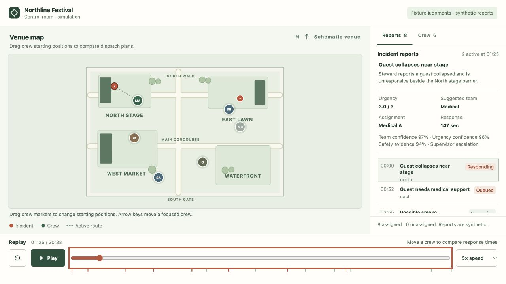
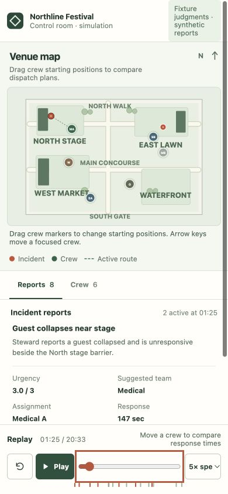

# Festival Control Room acceptance evidence

Verified locally on 2026-09-28. All reports and fixture judgments are synthetic.

## Automated checks

- 14 Festival Control Room unit and HTTP tests passed. They cover deterministic replay, travel changes, waiting priority, crew reservations, no staffing, review gating, credential isolation, cached live responses, malformed numbers, contradictory probability distributions, API failures, and HTTP origin/content-type boundaries.
- All 76 repository tests passed through per-demo unittest discovery. A combined module invocation exposed an existing `promise_catcher` import assumption, so the complete run used each demo's supported discovery directory.
- `uvx ruff check demos/festival_control_room` passed.
- `uvx mypy demos/festival_control_room/festival_control_room.py demos/festival_control_room/test_festival_control_room.py` passed.
- `node --check demos/festival_control_room/static/app.js` and Python compilation passed.

Run the complete repository suite with:

```sh
for demo in demos/*; do
  python3 -m unittest discover -s "$demo" -p 'test_*.py' || break
done
```

## Browser evidence

Inspected the running page in the Codex browser at 1280 by 720 and 390 by 844. Both widths had no horizontal document overflow.

- Repeated keyboard moves changed Medical A's start from x=430 to 450 to 470. Its planned response changed from 147 to 156 to 164 seconds.
- Pointer dragging changed the response again. The plan reset to paused at time zero.
- Enabling the initially off-duty Medical B improved the mean response by 64 seconds while retaining all eight reports. The replay reset to paused at time zero.
- Play advanced the clock; pause, reset, speed controls, and range scrubbing remained available.
- The second report arrives at 52 seconds and moves while waiting for a medical crew. At 85 and 105 seconds, its marker moved from (749.44, 200.97) to (730.93, 216.71). Enabling Medical B dispatches it immediately at 52 seconds.
- Disabling all crews produced zero assigned and eight unassigned reports without claiming faster responses.
- A local TypeSafe transport stub failed once, then returned a valid typed response. The error preserved fixture provenance, Retry succeeded with the explicit test model, and switching back restored fixture provenance. This did not call TypeSafe.
- No browser errors or warnings appeared in the normal fixture session.

The screenshots below capture the fixture mode. The mobile image uses the actual viewport because the browser's full-page capture distorted the page.





## Review and limitations

Sol low workers implemented the backend and frontend in disjoint files. Independent Sol high review caught a contradictory-answer parsing gap. The parser now rejects mismatched Choice and Score distributions, and regression tests cover both cases. The backend reviewer passed the corrected implementation and the final code at `fa78a1d`. The independent visual reviewer requested earlier incident motion and clearer mobile map labels; both were resolved and the final disposition was ship. Design documentation is scoped to this demo.

No API key was available. Authenticated TypeSafe behavior, model accuracy, real service latency, and cost remain unmeasured. Straight-line travel and fixed service durations are illustrative rules. No real alerts, dispatches, or safety decisions leave this local demo.
